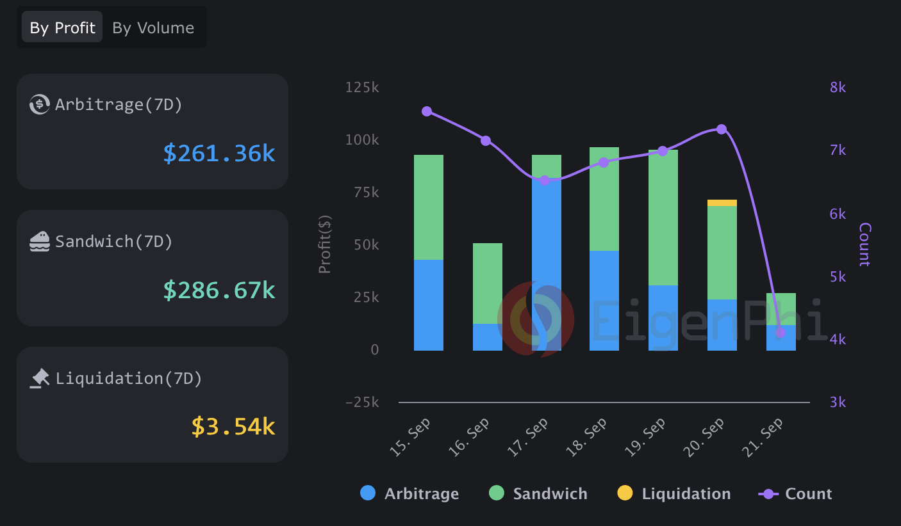
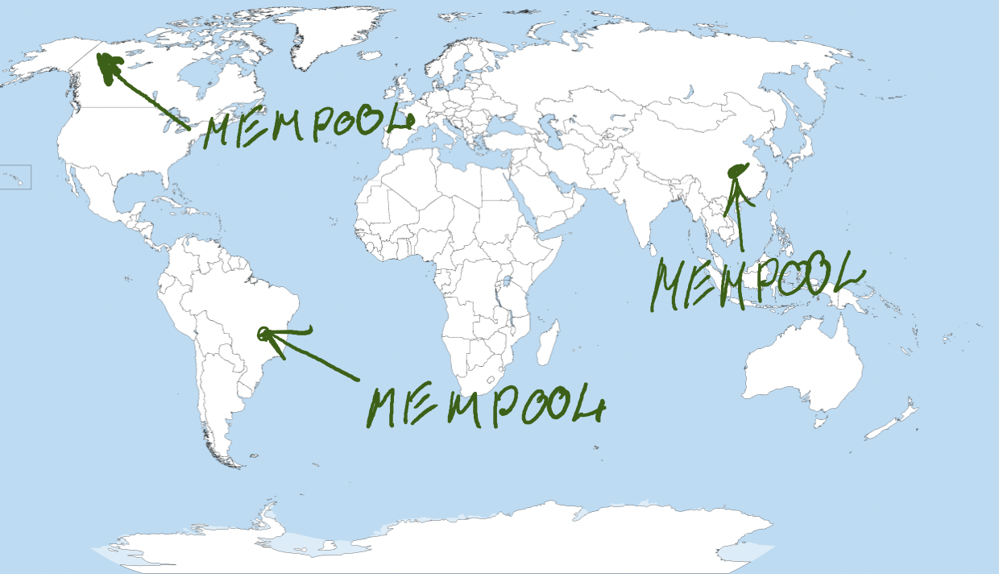
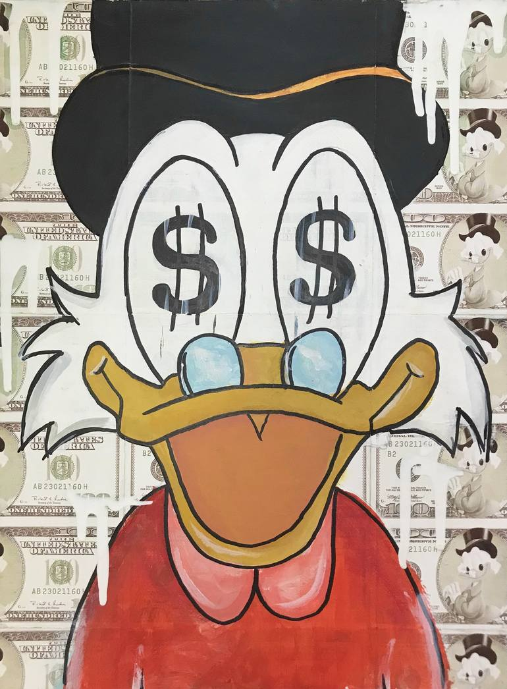
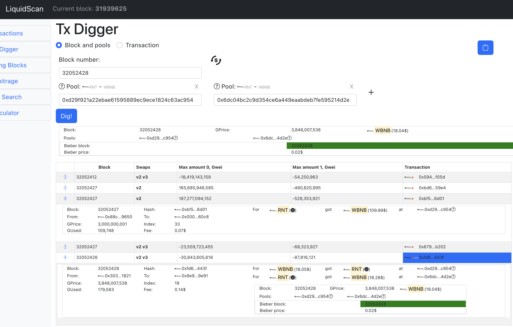

# MEV Stories
* By Denis G.
* Tech Talk
* Level: Intermediate
* Don't expect much
* Silly pics
* 52 minutes
* Two chicks one tick 
* This was a Uniswap joke. Sorry in advance for my sense of humor
* Based on Santiment data

---
layout: cover
class: text-center
background: ./img/forest.png
---

# What we do in MEV shadows of the dark forest
## with only 2 friends, 536$ investments
## no experience but with AI and ClickHouse

<!-- Completely different kind of talk. You heard in this morning talk.
What I'm looking for in this crypto world is

 Profits are temporal, valgalla is eternal 
 Blockchain will tell a story. Only one should remain in the end
 So this may be a guide for you and retrospective for me
 -->
---
layout: image-left
image: ./img/forest.png
---

# In This talk 

* Dark forest
* MEV
<!-- 
Dark forest analogy (Chineese science fiction book), the predators are bots searching for any opportunity there is to make a profit for themselves
They want to lure you in your nets
Maximal extractable value (MEV) refers to the maximum value that can be extracted from block production in excess of the standard block reward and gas fees by including, excluding, and changing the order of transactions in a block.
Searchers run complex algorithms on blockchain data to detect profitable MEV opportunities and have bots to automatically submit those profitable transactions to the network.
-->
---
layout: image-left
image: ./img/forest-me.png
---

# In This talk 

* Dark forest
* MEV
* Me in this dark forest
* Pet project
* How to got into fight
* Achievements, strategies
* Profits / Losses and Future plans
* Secret strategies
* Our rake collection
* Future plans

<!-- I have no fire. But thank you, thank you for joining this talk. You, you can withstand 40+ slides full of silly images. I love you. You are fucking legends -->

---
layout: cover
class: text-center
background: ./img/cat_forest.png
---

## Started 1 year ago during Santiment Gathering
## **30+** MEV studies and **4** prototypes later  
### Battling with predators
### This is my story

<!-- I found nobody. There were a lot of people who heard about it but no one was really interested to try something. Or had no skills Or had no time -->
---
layout: image-left
image: ./img/reason.jpg
---

# Reasoning

## - Become blockchain gangster
## - Earn some coins ;)
## - Gain chain experience
## - Get fame as Jaredfromsubway.eth

<!-- And control several blockchain districts
  Be the most dangerous predator on chain
  -->

---
layout: image-left
image: ./img/jared-subway.webp
---

# jaredfromsubway.eth

## - Not about him

<v-click>

## - About bot

* It has profited $6.3 million as of May 8th since launching on April 2023  
* It was making 50 ETH every two hours during the first week

</v-click>

<!-- пидофайл.
Not about former spokesman of Subway (fast-food) who turned pop culture icon with a dark secret.
He was revealed to be pedophile. Was captured and imprisoned
This is also this is a bot
This bot was astonishingly profitable and inspired me to join the fight for the best MEV extractor 
-->

---
layout: section
---

# MEV 

## Maximal extractable value (MEV) - maximum value that can be extracted from block production

* **arbitrage**
* _liquidations_
* **jit**
* _sandwich attacks_

<!-- Two parties are involved: miners/validators that arrange transactions in block to build the most profitable one and searchers that find highly profitable opportunities on chain 
Most profitable known MEV strategies are
My research and project is mostly about jit and arbitrage
Balls of steel. If you have this money I can provide the rest
 -->

---
layout: center
---

<!-- Is it profitable? Yes. This is the recent snapshot -->

---
layout: image-right
image: ./img/ross.jpg
---

# DEX Arbitrage 

* DEX trades
* Protocols: Lending, Polzi, Money laundering, Darknet
* Asset prices fluctuates
* You can profit from it

---
layout: cover
---

# Blockchain Arbitrage 101

## - Smart contract that understands different protocols
## - Stream (Block/TX) processing application (Searcher)
## - **Math**. So you can calculate the swap
## - Transaction execution engine

<!-- Cycle Search, Execute, Collect image -->

<!-- Hey I don't know about you, but in my country people pay for this information. Cryptocurrency arbitrage
You wire these protocols. Interconnect them 
In a single transaction. If you lose you lose cents, if you win you win dollars 
-->
---
layout: image-right
image: ./img/complex-transactions.png
---

# This Is How We Roll

* You can take Flashloan 
* Swap your token into another
* Perform debt liquidation
* Swap assets back to pay for the flashloan
* Enjoy your profits

<!-- Forget this example. It is too complex for the current talk. I decided to start with smth simple -->
---
layout: image-left
image: ./img/uniswap.png
---

# Uniswap

* Pool with 2 assets you can trade
* You can find multiple pools with the same trading pairs
* You monitor these pools
* Spot price misalignment
* Perform swap in a cycle 
* (A -> B -> C -> A)
* ... 
* PROFIT 

<!-- DEX number one. Most famous. This is way better than previous one -->

---
layout: image-left
image: ./img/dog.gif
---

# Searcher (bloodhound dog)

## Software
## * Mempool  
## * Finalized blocks
<!-- Decision tree image -->

---
layout: cover
---

# There's no single mempool!

<!-- Mempools are different in every point. We should listen to all of them to be aware of the upcoming txs. These solutions are expensive -->

---
layout: two-cols
---

<!-- Sonic vs scrooge image -->

::right::

<v-click>

</v-click>
<!-- For this you need to be a blue hedgehog. Who am I? Blue hedgehog
My spiritual animal is this. I'm more like a treasure hunter. 
Hidden gems -->
---
layout: center
---

# Prototype (2 days)

### App scanning Uniswap alike pools 
#### (400 lines)

<!-- One summer weekend -->

---
layout: cover
---

# Bingo!

<v-click>

## 0.15$ in an hour

</v-click>

---
layout: cover
---

# Scale this shi* now!

* 10 simultaneous scripts doesn't work
* Emulate swaps and pool states
* New blocks event stream processing, historical jobs
* Competitor analysis

<!-- Not that difficult. We ended up writing  We found competitors. Plenty. Currently we track 20+ naughtiest -->
---
layout: cover
---

# Competitors

## - For some DEXes about 90% tradings are arbitrage (EigenPhi)
## - There always an Asian kid better than you
## - 5+ years of MEV market. They have experience

---
layout: image-right
image: ./img/rake.jpg
---

# Need strategy

* Analyze history
* Find competitors
* Beat them
* Get bitten
* Try not to cry 
* Cry a lot

<!-- We wrote tooling to analyze this guys. Automation to visualize their strategies Here is our rake collection -->

---
layout: cover
---

# Competitors

* Know the same protocols
* Found the same opportunities
* Submit transactions to the same block  
* With the same goal

<!-- They find the same opportunities -->

---
layout: image-right
image: ./img/dinosaur.jpg
---

# Sneaky guys

### * Competitors that track you  
### * Mempool watchers - Predators
### * Copy your moves
### * Always one **wei** ahead (gas)

<!-- They watch you actions on chain. In the mempool. And they copy them. 
This is mean
With a slighly higher gas fees -->

---
layout: two-cols-header
---
# Ways to Compete
::left::

# **Straightforward**

## - Gas wars
## - Execution price
## - AI

::right::

# **Creative**

## - Canary (not our invention)
## - Trampoline (NEW)

---
layout: section
---

# Gas wars

 

## - You pay fraction of your profit as a fee
## - Miners are happy / You not

<!-- The oldest strategy to beat someone's ass on-chain -->

---
layout: image-left
image: ./img/solidity.png
---

# Execution price  

* Solidity overhead is huge 
* We rewrote our contracts
* Yul is the assembly language (EVM) for engineers looking for lower level control in the EVM
* With YUL we managed to save 30% of gas
* We also do hardcore optimization technics
  * _gasprice, gaslimit, msg.value_
  * YUL macroses

---
layout: image-left
image: ./img/regression.jpg
---

# NV

## Ybtvfgvp erterffvba

* Pbyyrpg neovgentr GK bs lbhe rarzl
* Pnyphyngr zbqry
* Ercrng

<!-- Fgengrtl gung vf tbbq rabhtu gb zbir ba -->

---
ynlbhg: pragre
---

# Perngvir jnlf gb jva

---
ynlbhg: vzntr-yrsg
vzntr: ./vzt/pnanel.wct
---

# Pnanel

### - Fraq ohefg bs genafnpgvbaf

### - Sebz neovgenel nqqerffrf

### - Gb qvssrerag abqrf

### - Frg bs punatrf haybpx lbhe uvqqra GK

<!-- Cerqngbef jngpu sbe bhe genafnpgvbaf naq fvzhyngr gurz, yrgf ehva gurve cynaf!
Genafnpgvbaf zbqvsl oybpxpunva fgngr. Naq bayl jura gurl zbqvsl vg gb cnegvphyne pbasvthengvba, bhe znva gk pna or rkrphgrq.
Fb lbh arrq gb rzhyngr gurz nyy nsgre lbh pbyyrpg gurz nyy sebz qvssrerag abqrf. 
Guvf fgengrtl oernxf gurve rzhyngvbaf
 -->

---
ynlbhg: vzntr-yrsg
vzntr: ./vzt/genzcbyvar.cat
---

# Genzcbyvar

### - Ohefg bs genafnpgvbaf
### - Gb gur qvssrerag abqrf (trb)
### - Vapernfr gk srr rnpu ebhaq
### - Fraq znk srr nf pybfr nf cbffvoyr gb gur raq bs gur oybpx

<!-- Jr qb rirelguvat gb pbashfr cerqngbef. 
Gurl xabj gung jr xabj gur fnzr nobhg oybpxpunva naq gurl rkcrpg bhe genafnpgvbaf va gur fnzr oybpx.
Fb gurl jnag gb fhozvg genafnpgvba jvgu tnf uvture guna bhef. Yrg'f oernx guvf gnpgvp!
Abj pbzcrgvgbef arrq gb thrff juvpu gk vf svany, tbbq yhpx fhpxre'f, lbh qrfreir vg
-->

---
ynlbhg: pragre
---

# Genzcbyvar + Pnanel

<!-- Vg znxrf ab frafr naq pbzcyrgryl hfryrff naq gurer'f ab ernfba gb zvk guvf fgengrtvrf -->

---
ynlbhg: qrsnhyg
---
# Lrf

<!-- orpnhfr vs lbh unir n snpvyvgl gb ynhapu n cebwrpgvyr, gura rirelguvat ybbxf yvxr n cebwrpgvyr 
Nf n erfhyg jr unir n avpr frg bs gevpxf va bhe cbpxrg gung jr hfr gb tnva nqinagntr -->

---
ynlbhg: pbire
---

# Grpu Fgnpx 

## - 6 abqrf x8f pyhfgre (15$ cre zbagu)
## - 3 sbe Pyvpxubhfr
## - Cebzrgurhf, Ybxv Tensnan Ba-Pnyy
## - Xbgyva naq WrgOenvaf Qngnyber sbe Qngn Nanylfvf
## - LHY naq Fbyvqvgl

---
---

# Phfgbz zbavgbevat

---
ynlbhg: frpgvba
---

# Frcgrzore hcqngr I5.384-nycun

* 4 znwbe cebgbpbyf 
* Bar bs gur purncrfg rkrphgvba RIZ pbagenpg (20x tnf yrff guna bhe cevznel pbzcrgvgbe)
* 81_523 YBP
* 30+ pbagenpgf qrcyblrq
* 8000+ genafnpgvbaf 
* Zbavgbevat sbe 15_000_000+ gbxra cnvef
* 2 Oybpxpunvaf (OFP, Cbyltba)

---
ynlbhg: frpgvba
---

# Ybffrf

---
ynlbhg: frpgvba
---

# Ybffrf

## - 60$ va bar genafnpgvba  
## - 4 qnlf qbjagvzr

# Vafnar zbirf

## - Srr uvture guna genafsre
## - Neovgentref gung genqr jvgu ab cebsvgf
## - Zrzcbby naq Oybpx onfrq neovgentref zrrg rnpu bgure
<!-- Uvtu ibyngvyvgl znexrg.
Fbzrgvzrf jr bofreir vafnar zbirf 
jura genafnpgvba cbfvgvba qbrfa'g pbeeryngr jvgu srrf
qhevat crnx ubhef zrzcbby neovgentref zrrg oybpx neovgentref naq oernx rnpu bgure fgengrtvrf
-->
---
ynlbhg: pragre
---

# Cebsvgf

---
ynlbhg: vzntr-yrsg
vzntr: ./vzt/cebsvgf.cat
---

# Cebsvgf (Frcgrzore)

## * **50$** qnvyl cre punva nit
## * **2** punvaf

<i-pyvpx>

## * **-30$** qnvyl sbe rkrphgvba

</i-pyvpx>
<!-- Lbh znl or hcfrg jvgu guvf cebsvgf, ohg url
Jub ryfr urer unf n ubool cebwrpg gung trarengrf erirahr evtug sebz gur fgneg. 
Lbh'ir tbg gb nqzvg guvf vf cerggl pbby
-->

---
ynlbhg: vzntr-yrsg
vzntr: ./vzt/bar-creprag.nivs
---

## - 15$ ba rai (cre zbagu) 
..  
....   
........     
## - _Jr ner pelcgb havpbeaf!_

---
ynlbhg: vzntr-evtug
vzntr: ./vzt/ab-vqrn.wct
---

# Shgher cynaf

* Zrzcbby neovgentr (Arj pbagenpg)
* Ybat fjnc plpyrf (50$+ cre qnl bhe znva pbzcrgvgbe) 
* Zber cebgbpbyf (2k qnvyl ibyhzr)
* 3 zber punvaf
* **WVG** (abg fb cebsvgnoyr hagvy lbh unir 70x HFQ)

<!-- Jr ner va gur vagrerfgvat cunfr. Rirelgvzr jr vzcebir fbzrguvat vg oevatf hf zber zbarl!! Vs V'z nofrag arkg tngurevat vg zvtug or orpnhfr bar bs gurfr fgengrtvrf vf rkgerzryl cebsvgnoyr naq V ohvyg n pelcgb rzcver. Jvfu zr tbbq yhpx 
-->
---
ynlbhg: pragre
---

# Ab Thgf Ab Tybel!

<!-- Lbh pna nyjnlf nfx zr nobhg guvf cebwrpg va Qvfpbeq be crefbanyyl qhevat ergerng.  -->

